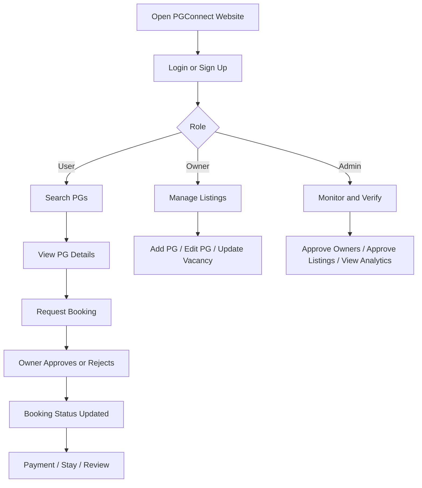
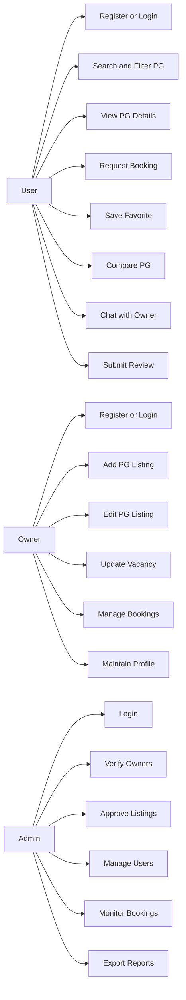
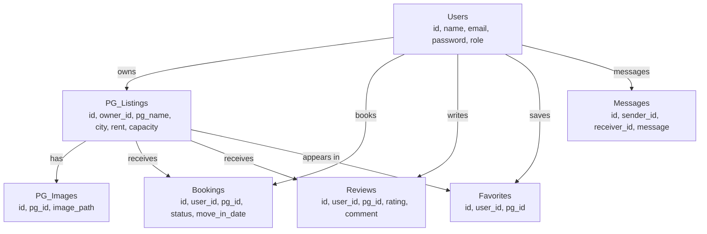

# PGConnect
## Complete Final Project Presentation
### PG Room Finder & Vacancy Management System

By Aevlin Prince  
S6 CSE-A  
Project Type: Web Application

## How This Presentation Is Connected
This presentation is prepared by combining:
- the actual implemented PGConnect codebase
- the academic structure expected from a mini project report
- the final-review expectations for topic, objectives, existing system, design, architecture, diagrams, timeline, and outcome

The referenced report file is:
- `PGConnect_Mini_Project_Report.pdf`

The project implementation referenced from the website includes:
- public landing and search pages
- user module
- owner module
- admin module
- backend services
- database schema and workflow

---

## Slide 1 - Title
**PGConnect**  
**PG Room Finder & Vacancy Management System**

Final Project Review  
Web Application Project

Presented by: Aevlin Prince  
Class: S6 CSE-A  
Guide: Ms. Shiney Thomas

### Presentation Opening
Good morning. My project is PGConnect, which stands for PG Room Finder and Vacancy Management System. It is implemented as a web application to help students and working professionals find PG accommodation easily, while also helping owners manage properties and admins maintain platform trust and control.

---

## Slide 2 - Project Topic and Domain
### Project Topic
PG accommodation discovery and vacancy management

### Domain
Web-based accommodation management system

### Why This Topic Was Selected
- PG search is still mostly manual
- availability information is often not updated
- there is no dedicated system focused only on PG accommodation
- students and working professionals need a simpler and more trustworthy process

### Why It Is Implemented as a Web Application
- accessible from browser without installation
- easy to use from desktop and mobile
- supports centralized updates
- suitable for multiple roles like user, owner, and admin
- easier deployment and maintenance

### What to Say
This project belongs to the web application domain and focuses on accommodation management. I selected this topic because finding PGs is still difficult in many places, and users often depend on brokers, calls, or outdated websites. A web application is the best choice because it is accessible, scalable, and suitable for role-based workflows.

---

## Slide 3 - Introduction
PGConnect is a centralized web platform created to simplify the process of:
- discovering PGs
- checking vacancy availability
- viewing details and facilities
- contacting owners
- sending booking requests
- managing listings and approvals

The system is designed for three major actors:
- User
- Owner
- Admin

### System Vision
To replace scattered, manual PG search processes with a structured and role-driven platform that supports both discovery and management.

### What to Say
PGConnect is not only a property listing website. It is a complete platform where a user can search and book PGs, an owner can manage listings and occupancy, and an admin can verify and monitor the platform.

---

## Slide 4 - Problem Statement
### Problems in the Current PG Search Process
- no centralized PG database
- outdated vacancy information
- dependence on calls and messages
- manual communication and delay
- no standard booking workflow
- limited owner-side control
- weak trust and verification

### Effect of These Problems
- users waste time
- owners depend on middlemen
- information is unreliable
- decision making becomes difficult
- the process is not transparent

### What to Say
The current PG search process is fragmented and inefficient. Users do not know whether a vacancy is really available, owners do not have an easy management platform, and there is no consistent booking mechanism. PGConnect is designed to solve exactly these issues.

---

## Slide 5 - Existing System and Gap Analysis
### Existing Platforms
- NoBroker
- MagicBricks
- 99acres
- NestAway
- Zolo

### Limitations of Existing System
- general property portals, not PG-specific
- vacancy data may be outdated
- not optimized for students
- some have high platform charges
- owners may not get full self-management
- no dedicated PG-first workflow

### Gap Identified
There is a need for a platform that is:
- focused only on PG accommodation
- vacancy-aware
- booking-enabled
- owner-manageable
- admin-monitored

### What to Say
Existing systems are either too generic or too premium. They do not fully address the day-to-day PG accommodation problem. This gap led to the development of PGConnect as a focused and practical alternative.

---

## Slide 6 - Proposed System
### Proposed Solution
PGConnect is a web-based PG Room Finder and Vacancy Management System that offers:
- centralized PG discovery
- real-time vacancy support
- role-based login
- owner self-management
- booking request handling
- admin verification and moderation

### Major Modules
- Public Interface
- Authentication Module
- User Module
- Owner Module
- Admin Module
- Backend Service Layer
- Database Layer

### What to Say
The proposed system is role-based and workflow-oriented. It connects the user, owner, and admin through one platform, making accommodation discovery and management more transparent and organized.

---

## Slide 7 - Objectives
### Main Objective
To build a complete and centralized web application for PG search, vacancy updates, booking flow, and listing management.

### Specific Objectives
- enable easy PG search by city and filters
- provide full PG details with images and location
- support secure signup and login
- allow users to request bookings online
- help owners add and manage PG listings
- let admins approve and monitor records
- improve trust through review and verification mechanisms

### What to Say
The goal is not only to display PG data but to support the complete lifecycle from search to booking to management and review.

---

## Slide 8 - Scope of the Project
### User Scope
- search PGs
- filter listings
- view PG details
- request booking
- save favorites
- compare PGs
- chat with owner
- review PG after stay

### Owner Scope
- create and manage PG listings
- update rent and bed availability
- upload images
- manage bookings
- update occupancy

### Admin Scope
- verify owners
- approve listings
- monitor users and bookings
- manage moderation and trust

### What to Say
The scope covers the main real-world stakeholders in the PG ecosystem. That is why the project is designed as a multi-module platform rather than a simple static website.

---

## Slide 9 - Technology Stack
### Front-End
- HTML
- CSS
- Bootstrap 5
- JavaScript
- Font Awesome
- Leaflet map library

### Back-End
- PHP

### Database
- MySQL

### Development Environment
- XAMPP

### What to Say
The system uses a simple but effective technology stack. PHP and MySQL are used for backend and persistence, Bootstrap is used for responsive front-end design, and Leaflet is used for map-based interaction.

---

## Slide 10 - Front-End Design Overview
### Design Style
- modern landing page
- card-based layouts
- gradient hero section
- responsive structure
- clean dashboard-style pages

### Front-End Highlights
- search-first homepage
- listing cards with rent and facilities
- detail page with image and map
- role-based dashboards
- consistent layout across pages

### UI Strengths
- easy navigation
- mobile responsive
- visually clear information hierarchy
- action buttons for booking and management

### What to Say
The front-end design is created to be simple and modern. Users can quickly move from homepage to listing to booking, while owners and admins get dashboard-based interfaces for management and control.

---

## Slide 11 - Main Pages in the Website
### Public Pages
- Home page
- Login page
- Signup page

### User Pages
- PG listings
- PG details
- Booking requests
- Favorites
- Saved PGs
- Compare page
- User profile
- Chat page

### Owner Pages
- Owner dashboard
- Add/Edit PG
- Owner bookings
- Owner profile
- Bulk upload

### Admin Pages
- Admin dashboard
- Admin all PGs
- Admin owners
- Admin users
- Admin bookings

### What to Say
The project includes separate interfaces for different roles. This improves usability and also clearly separates responsibilities in the system.

---

## Slide 12 - User Module
### Features Implemented
- role-based signup and login
- search with multiple filters
- PG listing view
- PG detail page with rent, amenities, trust score, and map
- booking request flow
- booking status tracking
- favorites and saved PGs
- compare functionality
- chat with owner
- reviews and ratings

### What to Say
The user module covers the full tenant journey, from discovering PGs to making a booking and finally giving a review after stay completion.

---

## Slide 13 - Owner Module
### Features Implemented
- owner dashboard
- verification status display
- PG search inside dashboard
- add and edit PG listings
- upload and manage listing details
- update available beds
- pause or resume listing
- mark listing as full
- manage booking requests
- view occupancy and booking count

### What to Say
The owner module is an important strength of the system. It allows owners to manage their PGs independently instead of relying on brokers or third-party listing agents.

---

## Slide 14 - Admin Module
### Features Implemented
- admin dashboard
- total PG, booking, and user statistics
- pending approvals tracking
- top city analytics
- booking status analytics
- owner verification handling
- listing approval support
- user and booking monitoring
- export options for reports

### What to Say
The admin module acts as the control center of PGConnect. It maintains trust, moderation, and platform quality through approval and monitoring features.

---

## Slide 15 - System Workflow
### Overall Workflow
1. Visitor opens website
2. User signs up or logs in
3. User searches and filters PGs
4. User views PG details
5. User sends booking request
6. Owner reviews and responds
7. Booking status changes through stages
8. Admin monitors activity and approvals

### What to Say
The workflow is role-driven. Each actor has a different path in the system, but all of them connect through the same backend and database.

---

## Slide 16 - System Architecture
### Three-Layer View
#### Presentation Layer
- homepage
- login/signup pages
- dashboards
- detail and listing pages

#### Application Layer
- authentication
- search and filtering
- booking management
- favorites
- compare
- reviews
- chat
- admin moderation

#### Data Layer
- MySQL database
- user data
- PG listing data
- booking data
- reviews
- favorites
- messages

### What to Say
The architecture is divided into front-end, business logic, and data storage. This keeps the project organized and makes it easier to maintain or expand.

---

## Slide 17 - Flowchart

### What to Say
This flowchart shows the overall movement through the system from entry to role-based activities and final outcomes.

---

## Slide 18 - Use Case Diagram

### What to Say
The use case diagram explains how each role interacts with the system. It clearly highlights the multi-role nature of PGConnect.

---

## Slide 19 - ER Diagram

### What to Say
The ER diagram shows the database-level relationships between users, listings, bookings, reviews, favorites, images, and messages. This structure supports the full workflow of the system.

---

## Slide 20 - Action Plan / Timeline with Guide
### Phase 1 - Analysis
- topic selection
- problem identification
- literature review
- guide discussion

### Phase 2 - Planning
- workflow design
- module division
- database planning
- interface planning

### Phase 3 - Front-End Development
- homepage
- authentication pages
- user pages
- dashboard pages

### Phase 4 - Backend Development
- login/signup logic
- PG listing handling
- booking logic
- reviews, favorites, chat
- role-based redirection

### Phase 5 - Testing and Review
- module validation
- booking flow testing
- owner/admin workflow testing
- final documentation and review preparation

### What to Say
The project was completed in multiple phases with regular feedback from the guide. This helped in improving both the structure and implementation quality over time.

---

## Slide 21 - Key Achievements
### Major Achievements
- built as a complete web application
- supports three distinct roles
- includes both front-end and back-end integration
- supports real booking flow
- includes owner-side management
- includes admin moderation and analytics
- integrates reviews, favorites, compare, and chat

### What to Say
The strongest part of this project is that it is not just a UI prototype. It includes multiple working modules and real business workflows across the system.

---

## Slide 22 - Limitations and Future Scope
### Current Limitations
- payment integration can be expanded further
- live notification support can be improved
- advanced recommendation engine is not yet added
- mobile app version is not yet developed

### Future Scope
- online payment gateway
- room recommendation engine
- GPS-based nearest PG discovery
- admin analytics dashboard enhancement
- mobile app implementation
- document upload and stronger verification workflow

### What to Say
The project already covers the core workflow, but in future it can be extended with payment integration, recommendations, stronger notifications, and mobile app support.

---

## Slide 23 - Conclusion
PGConnect is a complete PG Room Finder and Vacancy Management System implemented as a web application.

It successfully addresses:
- the lack of centralized PG discovery
- the issue of outdated vacancy information
- the need for booking workflow
- the need for owner self-management
- the need for admin trust and moderation

### Final Conclusion Statement
PGConnect provides a practical, scalable, and user-focused solution for PG accommodation management by integrating users, owners, and admins in one platform.

### What to Say
In conclusion, PGConnect is a practical and relevant web application that solves a real-world problem. It improves convenience, transparency, and system control compared to the traditional way of finding and managing PG accommodation.

---

## Slide 24 - Thank You
Thank You  
Questions?

### Final Closing Line
Thank you for listening. I am happy to answer any questions about the design, implementation, workflow, or future scope of the project.

---

## Short 10-Minute Speaking Version
My project is PGConnect, a web-based PG Room Finder and Vacancy Management System. The aim of this project is to simplify PG accommodation search for students and working professionals while also providing a management system for owners and administrators. In the existing system, users depend on general property websites, brokers, phone calls, and outdated vacancy information. There is no dedicated system focused on PG search and vacancy management.

PGConnect solves this by creating a centralized web platform. Users can sign up, log in, search PGs by city and filters, view complete details, check facilities, map location, ratings, trust score, and send booking requests. They can also save favorites, compare PGs, chat with owners, and submit reviews after their stay.

Owners get their own dashboard where they can add listings, edit PG information, update bed availability, upload images, manage bookings, and track occupancy. Admins get a separate control center to monitor users, bookings, listing approvals, owner verification, and analytics.

The project is built using PHP, MySQL, Bootstrap 5, JavaScript, and Leaflet. Architecturally, it follows a presentation layer, application layer, and data layer model. The database includes users, PG listings, bookings, reviews, favorites, messages, and images.

In conclusion, PGConnect is a complete multi-role web application that improves PG search, vacancy management, booking flow, and trust through admin verification and better system organization.

---

## Viva Support Questions
### Why did you choose this project?
Because PG accommodation search is still manual and unorganized, and there is a real need for a focused system.

### Why web app instead of mobile app?
Because a web app is easier to access, easier to deploy, and suitable for all user roles without installation.

### What are the main modules?
User module, owner module, admin module, backend service module, and database module.

### What makes this project different from existing systems?
It is PG-specific, role-based, booking-enabled, and includes owner self-management and admin verification.

### What is the future scope?
Payment integration, mobile app version, recommendation system, and stronger notification support.
