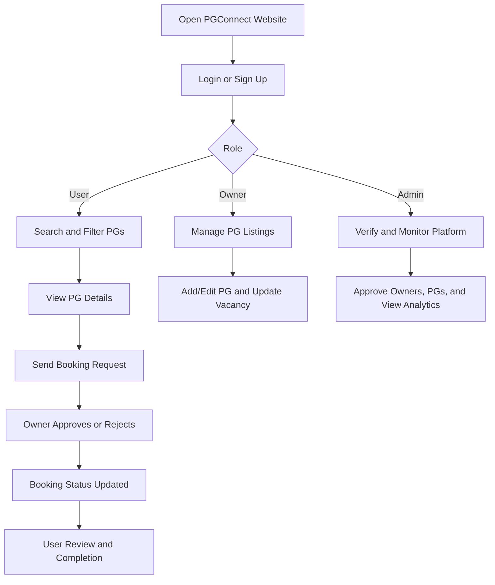
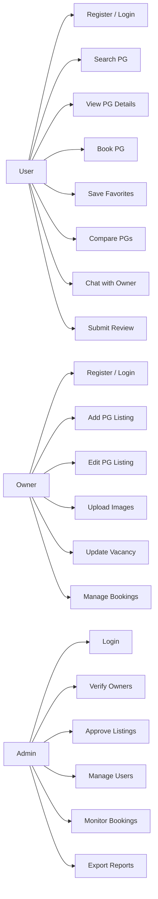
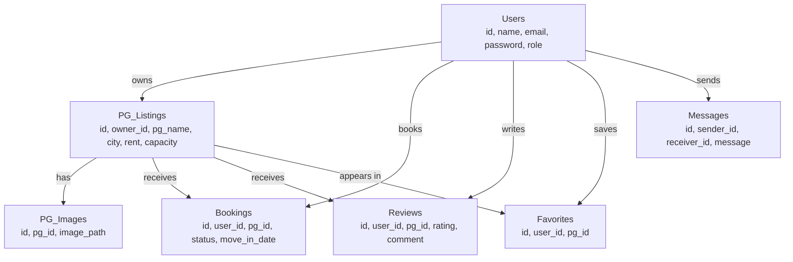

# PGConnect
## Final Project Review Presentation
### PG Room Finder & Vacancy Management System

By Aevlin Prince  
S6 CSE-A  
Project Type: Web Application

---

## 1. Title Slide
**PGConnect**  
**PG Room Finder & Vacancy Management System**

Final Project Review  
Web Application Project

Presented by: Aevlin Prince  
Class: S6 CSE-A  
Guide: [Guide Name]  
Review Duration: 10 Minutes

**What to say:**  
Good morning. My project is PGConnect, a web-based PG Room Finder and Vacancy Management System. This project is designed to help students and working professionals easily find paying guest accommodation and also help owners manage their listings, vacancies, and booking requests through a centralized platform.

---

## 2. Project Topic and Implementation Choice
### Project Topic
PG Room Finder & Vacancy Management System

### Implementation Type
This project is implemented as a **web application**.

### Why Web Application?
- easy to access from laptop and mobile browser
- no installation required
- simple for students, owners, and admin to use
- centralized database and real-time updates
- easier deployment and maintenance compared to a separate app build

### Core Idea
To create a dedicated PG platform where users can search and book PGs, owners can manage their properties, and admins can verify and monitor the overall system.

**What to say:**  
I selected this topic because PG accommodation search is still very unorganized. Many users depend on calls, WhatsApp messages, or general property websites. So I decided to implement it as a web application because it is easier to access, easier to maintain, and suitable for multi-role usage by users, owners, and admins.

---

## 3. Project Goals and Objectives
### Main Goal
To build a complete web platform for PG discovery, vacancy management, booking workflow, and listing administration.

### Objectives
- provide a centralized PG listing platform
- display real-time vacancy updates
- allow filtering by city, budget, sharing type, and amenities
- support booking requests and booking status tracking
- enable owners to add and manage PG listings
- allow admins to verify owners and approve listings
- improve trust using reviews, ratings, and verification

### Expected Outcome
- easier PG search process
- reduced manual communication
- better owner-side management
- more reliable vacancy information
- safer and more transparent platform

**What to say:**  
The main objective of PGConnect is not just to show PGs, but to support the complete workflow. That includes searching, viewing, booking, managing listings, and maintaining trust through admin verification and user reviews.

---

## 4. Existing System and Problem Analysis
### Existing System
Users currently depend on:
- brokers
- social media
- property portals like NoBroker, MagicBricks, and 99acres
- co-living platforms such as NestAway and Zolo

### Problems in Existing System
- not PG-specific
- outdated vacancy information
- no real-time availability updates
- manual calls and messages required
- high brokerage or platform charges
- no owner self-management dashboard
- no standardized booking workflow
- weak trust and verification mechanism

### Gap Identified
There is no dedicated system focused specifically on PG accommodation with user, owner, and admin workflows together.

**What to say:**  
The existing system is fragmented. Most platforms are made for general property listings, not for PG accommodation. Vacancy information is often outdated, and the process is still manual. So there is a clear need for a PG-specific solution with real-time updates and structured workflows.

---

## 5. Proposed System
### Proposed Solution: PGConnect
PGConnect is a centralized web system designed for:
- users searching and booking PGs
- owners managing properties and vacancies
- admins verifying and moderating the platform

### Main Modules
- Public and landing pages
- User module
- Owner module
- Admin module
- Backend and database module

### Major Features
- authentication and role-based login
- advanced search and filtering
- detailed PG view with images and map
- booking request and booking tracking
- favorites and compare
- reviews and ratings
- owner dashboard and listing controls
- admin approvals and analytics

**What to say:**  
The proposed system is a role-based web application. Instead of a simple listing site, PGConnect works as a complete accommodation management platform with different responsibilities for users, owners, and administrators.

---

## 6. Front-End Design and User Interface
### Design Direction
The front-end is designed with a modern and clean style using:
- Bootstrap 5
- responsive layout
- gradient-based hero section
- soft cards and shadows
- map-integrated listing pages

### Front-End Pages Included
#### Public Pages
- Home page
- Login page
- Signup page

#### User Pages
- PG listings page
- PG detail page
- Booking requests page
- Saved PGs / favorites
- Compare page
- Chat page
- User profile page

#### Owner Pages
- Owner dashboard
- Add/Edit PG page
- Owner bookings page
- Owner profile page

#### Admin Pages
- Admin dashboard
- Admin PG approval pages
- Admin owner management
- Admin user management
- Admin bookings monitor

### UI Strengths
- user-friendly and structured layout
- responsive for desktop and mobile
- search-first homepage
- visual clarity using cards and badges
- simple navigation between modules

**What to say:**  
The front-end design focuses on usability. The landing page gives a modern first impression, while the listing and detail pages are designed to help users make decisions quickly. Separate dashboards are also created for owners and admins so each role gets the tools they need.

---

## 7. Project Workflow / System Architecture
### Overall Workflow
1. User visits homepage
2. User signs up or logs in
3. User searches PGs using filters
4. User views PG details
5. User sends booking request
6. Owner receives and manages request
7. Admin monitors listings, owners, and bookings

### Architecture Layers
#### Presentation Layer
- `index.php`
- login/signup pages
- user, owner, and admin dashboards

#### Application Layer
- authentication logic
- search logic
- booking processing
- favorites, compare, reviews, chat

#### Data Layer
- MySQL database
- users
- PG listings
- bookings
- reviews
- favorites
- messages

### Technology Stack
- PHP
- MySQL
- Bootstrap 5
- Leaflet Map
- Font Awesome

**What to say:**  
The architecture follows a simple layered model. The front-end handles user interaction, the PHP backend processes business logic, and the MySQL database stores structured data. This makes the project organized, scalable, and suitable for real deployment.

---

## 8. Flowchart / System Flow
### Basic System Flow
User / Owner / Admin enters system  
↓  
Authentication  
↓  
Role-based redirection  
↓  
User searches PG / Owner manages listing / Admin verifies records  
↓  
Booking and approval flow  
↓  
Review, update, and monitoring

### Flowchart Representation

**What to say:**  
This flowchart shows the overall movement through the system. After authentication, the workflow depends on the role. Users continue with search and booking, owners continue with listing management, and admins continue with verification and monitoring.

---

## 9. Use Case Diagram
### Actors
- User
- Owner
- Admin

### User Use Cases
- register/login
- search PGs
- filter listings
- view PG details
- save favorites
- compare PGs
- send booking request
- chat with owner
- submit review

### Owner Use Cases
- register/login
- update profile
- add PG listing
- edit PG listing
- upload images
- update vacancy and rent
- manage bookings
- approve or reject requests

### Admin Use Cases
- login
- verify owner
- approve PG listing
- manage users
- monitor bookings
- export reports

### Use Case Diagram

**What to say:**  
The use case diagram clearly shows the role-based nature of the system. Users focus on accommodation discovery and booking, owners focus on listing and vacancy management, and admins focus on control, trust, and moderation.

---

## 10. ER Diagram
### Main Entities
- Users
- PG_Listings
- PG_Images
- Bookings
- Reviews
- Favorites
- Messages

### Relationships
- one owner can manage many PG listings
- one user can create many bookings
- one PG can have many bookings
- one user can save many PGs
- one user can submit many reviews
- one PG can receive many reviews
- one listing can have multiple images
- users and owners can exchange messages

### ER Diagram

**What to say:**  
The ER diagram shows the database structure behind the platform. Users are connected to bookings, reviews, favorites, and messages. Owners are also stored in the users table through role-based differentiation, and each PG listing is connected to bookings, images, and reviews.

---

## 11. Project Timeline / Action Plan with Guide
### Timeline Followed
#### Phase 1 - Requirement Analysis
- identified problem domain
- discussed project scope with guide
- studied existing systems

#### Phase 2 - Design and Planning
- prepared workflow
- designed page structure
- planned database entities
- finalized web application approach

#### Phase 3 - Front-End Development
- created landing page
- developed login and signup pages
- designed user, owner, and admin interfaces

#### Phase 4 - Backend and Database Development
- implemented authentication
- created listing and booking modules
- added review, favorites, and chat support
- connected pages to MySQL database

#### Phase 5 - Testing and Review
- validated module flow
- checked role-based redirection
- reviewed listing and booking process
- prepared final project review documentation

### Guide Interaction
- regular review of progress
- module discussion after each implementation phase
- feedback on workflow and features
- validation of architecture and project direction

**What to say:**  
The project was developed in phases under guide supervision. First, I analyzed the problem and studied existing systems. Then I designed the workflow and database, implemented front-end and backend modules, and finally tested the system and prepared it for final review.

---

## 12. Project Completion Status and Final Outcome
### Completed Modules
- landing page and public interface
- login and signup
- user listing and search module
- PG detail page
- booking request flow
- favorites and compare
- reviews and ratings
- owner dashboard
- owner listing management
- admin dashboard
- owner verification and listing approval support
- backend integration with database

### Final Outcome
PGConnect is a functional multi-role web application that solves a real accommodation problem with:
- better vacancy transparency
- structured booking lifecycle
- owner self-management
- admin verification and monitoring
- user-friendly front-end experience

### Conclusion
This project demonstrates how a web application can improve PG accommodation search and management by making the entire process centralized, transparent, and easier for all stakeholders.

**What to say:**  
In conclusion, PGConnect is a complete web application that combines search, booking, management, and moderation into a single platform. It addresses a real-world problem and provides a practical solution for users, owners, and administrators.

---

## Short Viva Closing
PGConnect is a web-based PG room finder and vacancy management system designed to make accommodation discovery, booking, and property management more efficient. The project includes a complete user module, owner module, admin module, database design, and backend services. It improves upon the existing system by providing a centralized, verified, and workflow-driven platform.
